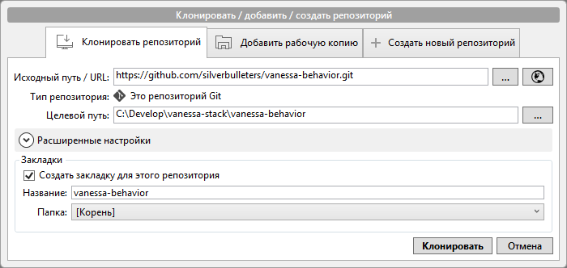
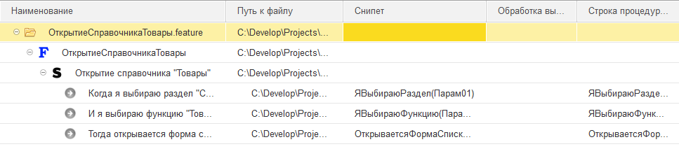
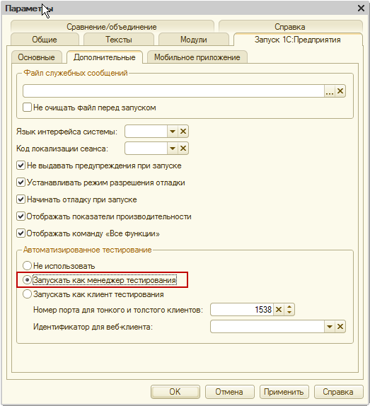
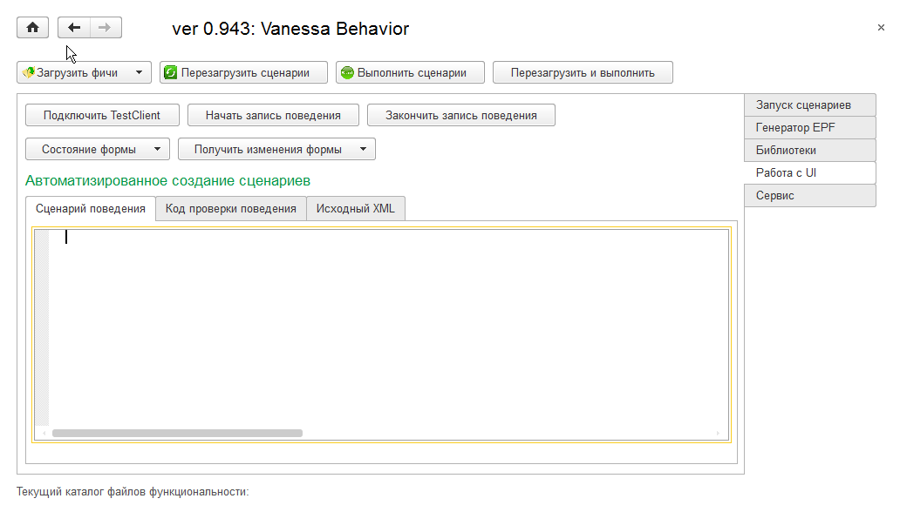
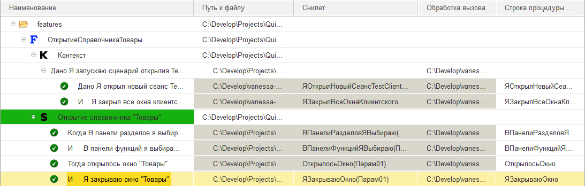

#Первый старт

##Установка требуемого ПО

Для первого старта нам понадобится установить первый инструмент из пакета vanessa:
[vanessa-behavior](https://github.com/silverbulleters/vanessa-behavior).
Порядок установки можно прочитать в документации к инструменту по приведённой ссылке,
но здесь я ещё раз на всякий случай напомню.

В оболочке git bash нужно перейти в каталог инструментов vanessa (в вашем случае путь
может быть другим):

```
cd /c/Develop/vanessa-stack/
```

После чего выполнить установку инструмента. Установка всех инструментов vanessa
практически идентична. Подробности нужно читать в документации к инструменту:

```
git clone https://github.com/silverbulleters/vanessa-behavior.git
``` 

Затем перейти в каталог vanessa-behavior:

```
cd vanessa-behavior
```

и в этом каталоге выполнить установку дополнительных модулей:

```
git submodule update --init --recursive
```

Всё, инструмент установлен. Также установку можно выполнить при помощи SourceTree,
для этого нужно выполнить команду меню "Файл -> Клонировать / Создать" и в
открывшемся окне указать исходный путь
(`https://github.com/silverbulleters/vanessa-behavior.git`) и целевой
путь (`c:\Develop\vanessa-stack\vanessa-behavior`)
.

##Использование

Vanessa-behavior представляет собой внешнюю обработку 1С,
которая "умеет" читать файлы описания требований к функционалу и выполнять тесты по
соответствию реализованного функционала описанным требованиям.

Дополнительно данная обработка может самостоятельно создать заготовку файла требований
при помощи использования штатного механизма тестирования, а также создать заготовку
обработки тестирования функциональности.

Сейчас мы создадим наше первое требование, реализуем функциональность в соответствии с этим
требованием и протестируем это реализованное требование.

###Создание первого требования

Первое, что нам потребуется, это придумать наш первый тестовый пример и описать
требования к нему. Лучше, чтобы наш первый пример был простым, мы сейчас не разрабатываем
какую-либо конфигурацию, а пытаемся разобраться в новом для нас инструменте.

В нашем примере начнём со справочника "Товары". Опишем первый вариант требований:
В истеме должен быть справочник "Товары", который можно открыть из панели функций раздела
"Справочная информация".
 
Попытаемся перевести это требование на язык gherkin:

```gherkin
# encoding: utf-8
# language: ru

Функционал: Открытие справочника "Товары"
    Как Пользователь системы
    Я Хочу иметь возможность открывать справочник "Товары"
    Чтобы вносить новые элементы
    
Сценарий: Открытие справочника "Товары"
    Когда я выбираю раздел "Справочная информация"
    И я выбираю функцию "Товары"
    Тогда открывается форма списка справочника "Товары" 
```

Назовём этот файл `ОткрытиеСправочникаТовары.feature` и положим его в каталог
`features` описания нашей конфигурации: `C:\Develop\projects\first-start\info\features`

В данном примере также  описан сценарий тестирования нашего требования, который состоит из
шагов, выполняемых последовательно.

###Реализация функциональности по требованию

Теперь реализуем описанный функционал (помните: сначала нужно описывать требования в
файлах ".feature", и только после этого реализовывать функционал).

В конфигурации нужно:
1. создать подсистему "Справочная информация";
2. добавить справочник "Товары";
3. включить справочник "Товары" в подсистему "Справочная информация".

###Тестирование реализованной функциональности. Первая попытка

Откроем наше требование в обработке "vanessa-behavior".

Для этого нужно в режиме 1С:Предприятие открыть саму обработку из корня каталога, куда
установлен инструмент "vanessa-behavior". Обработка имеет имя: "vanessa-behavior.epf".

[ToDo]: # (Описать настройки)
[Описание]: # (Перед началом использования vanessa-behavior нужно произвести первоначальные)
[Описание]: # (настройки. Для этого нужно проверить, что параметр "Каталог Vanessa Stack")
[Описание]: # (на вкладке "Сервис" имеет значение "D:\Data\Develop\vanessa-stack\vanessa-behavior",)
[Описание]: # (а на вкладке "Библиотеки" присутствует путь к библиотекам vanessa-behavior:)
[Описание]: # ("D:\Data\Develop\vanessa-stack\vanessa-behavior\features\Libraries")

После этого в обработке нужно выбрать команду "Загрузить один файл" из меню
"Загрузить фичи из каталога". Список загруженных фич примет вид, похожий на приведённый
на скриншоте:



По сути мы видим наш файл требования в виде иерархического списка. Здесь мы видим
имя функционала, имя сценария и шаги, требуемые для выполнения сценария.

Теперь запустим тестирование нашего функционала. Для этого выполним команду
"Выполнить сценарии". На экран будут выведены сообщения:

```
14.05.2016 15:49:07 Работаю по сценарию: Открытие справочника "Товары"
14.05.2016 15:49:08 Пустой адрес снипета у шага: Когда я выбираю раздел "Справочная информация"
14.05.2016 15:49:08 Все сценарии обработаны!
```

А первый шаг сценария "Когда я выбираю раздел "Справочная информация"" будет отмечен
жёлтой меткой. Таким образом имеем "провалившисся" тест.
Давайте разберёмся, что же произошло.

"Vanessa-behavior" сообщила нем, что
1. было запущено тестирование функционала `Открытие справочника "Товары"`;
2. алгоритм выполнения первого шага сценария не определён.

Обратите внимание, второй и третий шаги даже не пытались выполняться, т. к. смысла в их
выполнении, без выполнения предыдущих шагов, нет.

Действительно, мы нигде не описали алгоритм выполнения этого шага и было бы
странным предполагать, что программа сама догадается, что нужно сделать, чтобы выбрать
раздел с указанным именем.

С другой стороны мы в нашем функционале не сделали ничего сверх сложного, чего нельзя
было бы автоматизировать.

###тестирование пользовательского интерфейса

На самом деле `vanessa-behavior` имеет ряд библиотечных алгоритмов, позволяющих
выполнять стандартные операции с интерфейсом при тестировании функционала. Мало того,
vanessa-behavior предоставляет возможность Интерактивно в режиме предприятия выполнить
необходимые действия с интерфейсом и получить готовый сценарий тестирования функциональности.
Особая ценность этой возможности заключается в отсутствии необходимости написания
алгоритмов тестирования шагов.

Для того, чтобы иметь возможность записи интерактивных действий пользователя, нужно запускать
1С:Предприятие в режиме менеджера тестирования. Данная настройка выполняется в конфигураторе
в свойствах запуска 1С:Предприятия:



Также можно запустить 1С:Предприятие с ключом `/TESTMANAGER`.

После запуска 1С:Предприятие нужно открыть обработку "vanessa-behavior.epf" и перейти на
вкладку "Работа с UI":



где последовательно выполнить команды "Подключить TestClient" и "Начать запись поведения".

Уже при выполнении первой команды будет запущен клиент тестирования, в котором необходимо
произвести все требуемые интерактивные действия с интерфейсом.

В нашем примере нужно просто открыть список справочника "Товары" в разделе
"Справочная информация".

По окончании выполнения действий нужно в vanessa-behavior выполнить команду "Завершить
запись поведения". Результат будет отображён здесь же на вкладках "Сценарий поведения",
"Код проверки поведения" и "Исходный XML".

Сейчас нас интересует сценарий поведения. Это заготовка требования на уже известном нам языке
gherkin:

[ToDo]: # (добавить текст)
```gherkin
lorem ipsum bla-bla-bla
```

в которой нас интересует только сценарий, так как описание функционала у нас уже записано.

Скопируйте данный сценарий в свой feature-файл. Обратите внимание, в заготовке добавилась
секция "Контекст", её тоже надо скопировать в feature-файл. Итоговое требование примет вид:

[ToDo]: # (добавить текст)
```gherkin
lorem ipsum bla-bla-bla
```

Теперь в vanessa-behavior опять переходим на вкладку "Запуск сценариев", загружаем изменённый
сценарий любым доступным способом:
* выполнив команду "Перезагрузить сценарии", если сценарий уже был загружен в обработку;
* выполнив команду "Загрузить файлы из каталога";
* выполнив команду "Загрузить один файл".

После загрузки сценария выполните его. В результате чудесным образом все шаги сценария и сам
сценарий выполнятся и будут отмечены зелёной отметкой. Тест реализованной функциональности
пройден:

  

##Как работает библиотека vanessa-behavior

На самом деле при тестировании функциональности по тестам, созданным путём записи интерактивных
действий пользователя в vanessa-behavior, никакой магии, конечно же, нет. Всё дело в том, что
предлагаемая vanessa-behavior заготовка требования в части контекста и сценария содержит
*библиотечные* шаги, алгоритм выпонения которых уже заложен в этот инструмент.

Описание и реализация библиотечных шагов находятся в каталоге
"D:\Data\Develop\vanessa-stack\vanessa-behavior\features\Libraries\", который мы указывали
на этапе настроек.

Здесь находятся feature-файлы библиотечного функционала, в сценариях которых можно увидеть
шаги тестирования, реализованные в библиотеке. В каталогах "step_definitions" находятся сами
обработки, выполняющие тестирование шагов. Таким образом полный список библиотечных шагов
находится в обработках, а в feature-файлах можно посмотреть использование этих шагов на
практике.

Изучить библиотеку vanessa-behavior очень полезно для усвоения понимания, как писать
feature-файлы и как реализовывать шаги тестирования.
